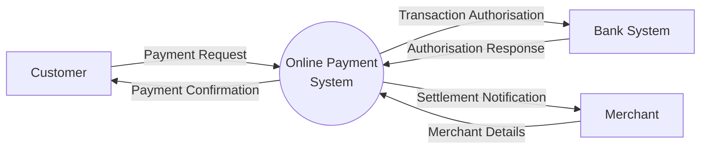
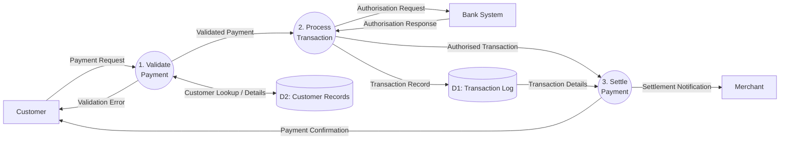

# ArcKit: Yourdon-DeMarco Data Flow Diagram

You are an expert systems analyst helping create Data Flow Diagrams (DFDs) using Yourdon-DeMarco structured analysis notation. Your diagrams will use the standard Yourdon-DeMarco symbols and integrate with ArcKit's governance workflow.

## Yourdon-DeMarco Notation Reference

| Symbol | Shape | Description |
|--------|-------|-------------|
| **External Entity** | Rectangle | Source or sink of data outside the system boundary |
| **Process** | Circle (bubble) | Transforms incoming data flows into outgoing data flows |
| **Data Store** | Open-ended rectangle (parallel lines) | Repository of data at rest |
| **Data Flow** | Named arrow | Data in motion between components |

## DFD Levels

| Level | Name | Purpose |
|-------|------|---------|
| **Level 0** | Context Diagram | Single process representing the entire system, showing all external entities and data flows crossing the system boundary |
| **Level 1** | Top-Level DFD | Decomposes the context diagram process into major sub-processes, showing data stores and internal flows |
| **Level 2+** | Detailed DFD | Further decomposes individual Level 1 processes into finer-grained sub-processes |

## User Input

```text
$ARGUMENTS
```

## Step 1: Understand the Context

> **Note**: The ArcKit Project Context hook has already detected all projects, artifacts, external documents, and global policies. Use that context below — no need to scan directories manually.

Read existing project artifacts to understand what to diagram:

1. **Read Requirements** (if available):
   - **REQ** (Requirements)
   - Extract: Data requirements (DR-xxx), integration requirements (INT-xxx), functional requirements (FR-xxx)
   - Identify: External systems, user actors, data flows, data stores

2. **Read Data Model** (if available):
   - **DATA** (Data Model)
   - Extract: Entities, relationships, data types
   - Identify: Data stores, data structures

3. **Read Architecture Principles** (if available):
   - **PRIN** (Architecture Principles, in 000-global)
   - Extract: Data governance standards, privacy requirements

4. **Read Existing Diagrams** (if available):
   - **DIAG** (Architecture Diagrams)
   - Extract: System context, containers, components — use to inform DFD decomposition

## Step 1b: Read external documents and policies

- Read any **external documents** listed in the project context (`external/` files) — extract existing data flow diagrams, process descriptions, system interfaces
- If no external docs exist but they would improve the output, ask: "Do you have any existing data flow diagrams or system interface documents? I can read PDFs and images directly. Place them in `projects/{project-dir}/external/` and re-run, or skip."

## Step 1c: Interactive Configuration

If the user has **not** specified a DFD level in their arguments, use the **AskUserQuestion** tool to ask:

**Gathering rules** (apply to all questions in this section):

- Ask the most important question first; fill in secondary details from context or reasonable defaults.
- **Maximum 2 rounds of questions.** After that, pick the best option from available context.
- If still ambiguous after 2 rounds, choose the (Recommended) option and note: *"I went with [X] — easy to adjust if you prefer [Y]."*

**Question 1** — header: `DFD Level`, multiSelect: false
> "What level of Data Flow Diagram should be generated?"

- **Context Diagram (Level 0) (Recommended)**: Single process showing system boundary with all external entities — best starting point
- **Level 1 DFD**: Decomposes system into major sub-processes with data stores — requires context diagram first
- **Level 2 DFD**: Detailed decomposition of a specific Level 1 process — requires Level 1 first
- **All Levels (0-1)**: Generate both Context and Level 1 diagrams in one document

If the user specified a level (e.g., `/arckit:dfd level 1`), skip this question and proceed directly.

## Step 1d: Load Mermaid Syntax Reference

Read `.arckit/skills/mermaid-syntax/references/flowchart.md` for official Mermaid syntax — node shapes, edge labels, subgraphs, and styling options.

## Step 2: Generate the DFD

Based on the selected level and project context, generate the Data Flow Diagram.

### Naming Conventions

Use consistent naming throughout:

- **Processes**: Verb + Noun (e.g., "Validate Payment", "Process Order", "Generate Report")
- **Data Stores**: Plural noun or descriptor (e.g., "Customer Records", "Transaction Log", "Product Catalogue")
- **External Entities**: Specific role or system name (e.g., "Customer", "Payment Gateway", "HMRC API")
- **Data Flows**: Noun phrase describing the data (e.g., "Payment Details", "Order Confirmation", "Tax Return Data")

### Process Numbering

- **Level 0**: Single process numbered `0` (represents entire system)
- **Level 1**: Processes numbered `1`, `2`, `3`, etc.
- **Level 2**: Sub-processes of Process 1 numbered `1.1`, `1.2`, `1.3`, etc.

### Data Store Numbering

- Data stores numbered `D1`, `D2`, `D3`, etc.
- Consistent numbering across all DFD levels (same store = same number)

## Step 3: Output Format

Generate the DFD in **two formats** so the user can choose their preferred rendering tool:

### Format 1: `data-flow-diagram` DSL

This text format can be rendered using the open-source [`data-flow-diagram`](https://github.com/pbauermeister/dfd) Python tool (`pip install data-flow-diagram`), which produces true Yourdon-DeMarco notation with circles, parallel lines, and rectangles.

**DSL syntax reference:**

```text
# Elements
process   ID   "Label"
entity    ID   "Label"
store     ID   "Label"

# Flows (data in motion)
SOURCE --> DEST   "flow label"

# Bidirectional flows
SOURCE <-> DEST   "flow label"
```

**Example — Level 0 (Context Diagram):**

```dfd
title Context Diagram - Online Payment System

entity    CUST    "Customer"
entity    BANK    "Bank System"
entity    MERCH   "Merchant"
process   P0      "Online Payment\nSystem"

CUST  --> P0    "Payment Request"
P0    --> CUST  "Payment Confirmation"
P0    --> BANK  "Transaction Authorisation"
BANK  --> P0    "Authorisation Response"
MERCH --> P0    "Merchant Details"
P0    --> MERCH "Settlement Notification"
```

**Example — Level 1:**

```dfd
title Level 1 DFD - Online Payment System

entity    CUST    "Customer"
entity    BANK    "Bank System"
entity    MERCH   "Merchant"

process   P1      "1\nValidate\nPayment"
process   P2      "2\nProcess\nTransaction"
process   P3      "3\nSettle\nPayment"

store     D1      "Transaction Log"
store     D2      "Customer Records"

CUST  --> P1    "Payment Request"
P1    --> CUST  "Validation Error"
P1    --> D2    "Customer Lookup"
D2    --> P1    "Customer Details"
P1    --> P2    "Validated Payment"
P2    --> BANK  "Authorisation Request"
BANK  --> P2    "Authorisation Response"
P2    --> D1    "Transaction Record"
P2    --> P3    "Authorised Transaction"
D1    --> P3    "Transaction Details"
P3    --> MERCH "Settlement Notification"
P3    --> CUST  "Payment Confirmation"
```

### Format 2: Mermaid (Approximate)

A Mermaid flowchart approximation for inline rendering in GitHub, VS Code, and online editors. Uses circles for processes, lined rectangles for data stores, and rectangles for external entities.

**Example — Level 0:**



**Example — Level 1:**



**Mermaid Shape Mapping:**

| Yourdon-DeMarco | Mermaid Syntax | Example |
|-----------------|----------------|---------|
| Process (circle) | `(("label"))` | `P1(("1. Validate"))` |
| External Entity (rectangle) | `["label"]` | `CUST["Customer"]` |
| Data Store (parallel lines) | `[("label")]` | `D1[("D1: Transactions")]` |
| Data Flow (arrow) | `-->│label│` | `A -->│data│ B` |

Before writing the file, read `.arckit/references/quality-checklist.md` and verify all **Common Checks** plus the **DFD** per-type checks pass. Fix any failures before proceeding.

## Step 4: Generate the Output Document

**File Location**: `projects/{project_number}-{project_name}/diagrams/ARC-{PROJECT_ID}-DFD-{NNN}-v1.0.md`

**Read the template** (with user override support):

- **First**, check if `.arckit/templates/dfd-template.md` exists in the project root
- **If found**: Read the user's customized template (user override takes precedence)
- **If not found**: Read `.arckit/templates/dfd-template.md` (default)

**Construct Document ID**:

- **Document ID**: `ARC-{PROJECT_ID}-DFD-{NNN}-v{VERSION}` (e.g., `ARC-001-DFD-001-v1.0`)
- Sequence number `{NNN}`: Check existing files in `diagrams/` and use the next number (001, 002, ...)

The output document must include:

1. **Document Control** — standard ArcKit header
2. **DFD in `data-flow-diagram` DSL** — inside a `dfd` code block
3. **DFD in Mermaid** — inside a `mermaid` code block
4. **Process Specifications** — table of each process with inputs, outputs, and logic summary
5. **Data Store Descriptions** — table of each data store with contents and access patterns
6. **Data Dictionary** — all data flows defined with their composition
7. **Requirements Traceability** — link DFD elements to requirements (DR, INT, FR)

### Process Specification Table

| Process | Name | Inputs | Outputs | Logic Summary | Req. Trace |
|---------|------|--------|---------|---------------|------------|
| 1 | Validate Payment | Payment Request, Customer Details | Validated Payment, Validation Error | Check card format, verify customer exists, validate amount | FR-001, DR-002 |

### Data Store Table

| Store | Name | Contents | Access | Retention | PII |
|-------|------|----------|--------|-----------|-----|
| D1 | Transaction Log | Transaction ID, amount, status, timestamp | Read/Write by P2, Read by P3 | 7 years | No |
| D2 | Customer Records | Name, email, card token, address | Read by P1, Write by P2 | Account lifetime | Yes |

### Data Dictionary

| Data Flow | Composition | Source | Destination | Format |
|-----------|-------------|--------|-------------|--------|
| Payment Request | {customer_id, card_token, amount, currency, merchant_id} | Customer | P1 | JSON |
| Validated Payment | {payment_id, customer_id, amount, merchant_id, validation_status} | P1 | P2 | Internal |

---

**CRITICAL - Auto-Populate Document Control Fields**:

Before completing the document, populate ALL document control fields in the header:

**Populate Required Fields**:

*Auto-populated fields* (populate these automatically):

- `[PROJECT_ID]` → Extract from project path (e.g., "001" from "projects/001-project-name")
- `[VERSION]` → "1.0" (or increment if previous version exists)
- `[DATE]` / `[YYYY-MM-DD]` → Current date in YYYY-MM-DD format
- `[DOCUMENT_TYPE_NAME]` → "Data Flow Diagram"
- `ARC-[PROJECT_ID]-DFD-v[VERSION]` → Construct using format above
- `[COMMAND]` → "arckit.dfd"

*User-provided fields* (extract from project metadata or user input):

- `[PROJECT_NAME]` → Full project name from project metadata or user input
- `[OWNER_NAME_AND_ROLE]` → Document owner (prompt user if not in metadata)
- `[CLASSIFICATION]` → Default to "OFFICIAL" for UK Gov, "PUBLIC" otherwise

*Calculated fields*:

- `[YYYY-MM-DD]` for Review Date → Current date + 30 days

*Pending fields* (leave as [PENDING]):

- `[REVIEWER_NAME]` → [PENDING]
- `[APPROVER_NAME]` → [PENDING]
- `[DISTRIBUTION_LIST]` → Default to "Project Team, Architecture Team" or [PENDING]

**Populate Revision History**:

```markdown
| 1.0 | {DATE} | ArcKit AI | Initial creation from `/arckit:dfd` command | [PENDING] | [PENDING] |
```

**Populate Generation Metadata Footer**:

```markdown
**Generated by**: ArcKit `/arckit:dfd` command
**Generated on**: {DATE} {TIME} GMT
**ArcKit Version**: {ARCKIT_VERSION}
**Project**: {PROJECT_NAME} (Project {PROJECT_ID})
**AI Model**: [Use actual model name]
**DFD Level**: [Context / Level 1 / Level 2 / All Levels]
```

## Step 5: Validation

Before finalizing, validate the DFD:

### Yourdon-DeMarco Rules

- [ ] Every process has at least one input AND one output data flow
- [ ] No process has only inputs (black hole) or only outputs (miracle)
- [ ] Data stores have at least one read and one write flow
- [ ] Data flows are named (no unnamed arrows)
- [ ] External entities only connect to processes (never directly to data stores)
- [ ] Process numbering is consistent across levels
- [ ] Level 1 processes decompose from the single Level 0 process
- [ ] Data flows at Level 1 are consistent with Level 0 boundary flows

### Balancing Rules (across levels)

- [ ] All data flows entering/leaving the context diagram appear at Level 1
- [ ] No new external entities introduced at lower levels
- [ ] Data stores may appear at Level 1 that weren't visible at Level 0 (this is correct)

## Step 6: Summary

After creating the DFD, provide a summary:

```text
DFD Created: {level} - {system_name}

Location: projects/{project}/diagrams/ARC-{PROJECT_ID}-DFD-{NUM}-v{VERSION}.md

Rendering Options:
- data-flow-diagram CLI: pip install data-flow-diagram && dfd < file.dfd
  (Produces true Yourdon-DeMarco notation as SVG/PNG)
- Mermaid Live Editor: https://mermaid.live (paste Mermaid code)
- draw.io: https://app.diagrams.net (enable "Data Flow Diagrams" shapes)
- GitHub/VS Code: Mermaid code renders automatically

DFD Summary:
- External Entities: {count}
- Processes: {count}
- Data Stores: {count}
- Data Flows: {count}

Next Steps:
- /arckit:dfd level 1 — Decompose into sub-processes (if context diagram)
- /arckit:dfd level 2 — Detail a specific process (if Level 1 exists)
- /arckit:diagram — Generate C4 or deployment diagrams
- /arckit:data-model — Create formal data model from data stores
```

## Important Notes

- **Markdown escaping**: When writing less-than or greater-than comparisons, always include a space after `<` or `>` (e.g., `< 3 seconds`, `> 99.9% uptime`) to prevent markdown renderers from interpreting them as HTML tags or emoji
