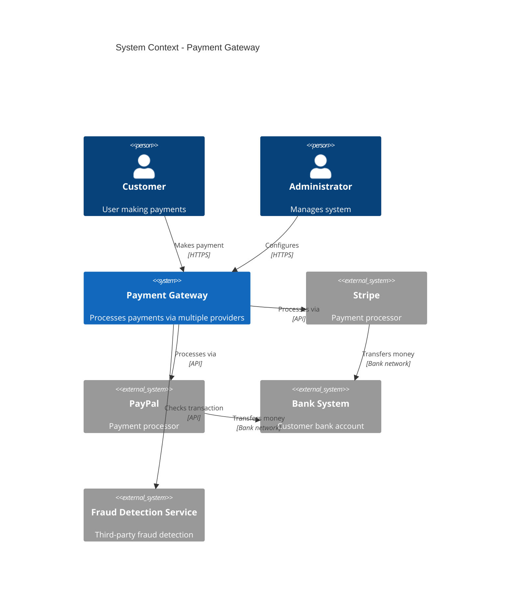
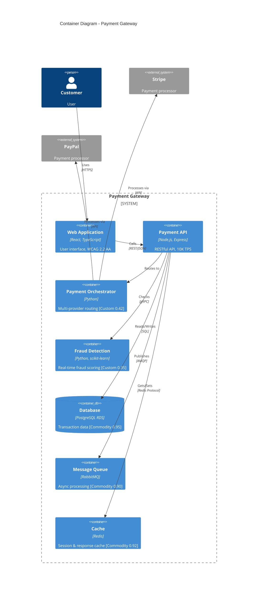
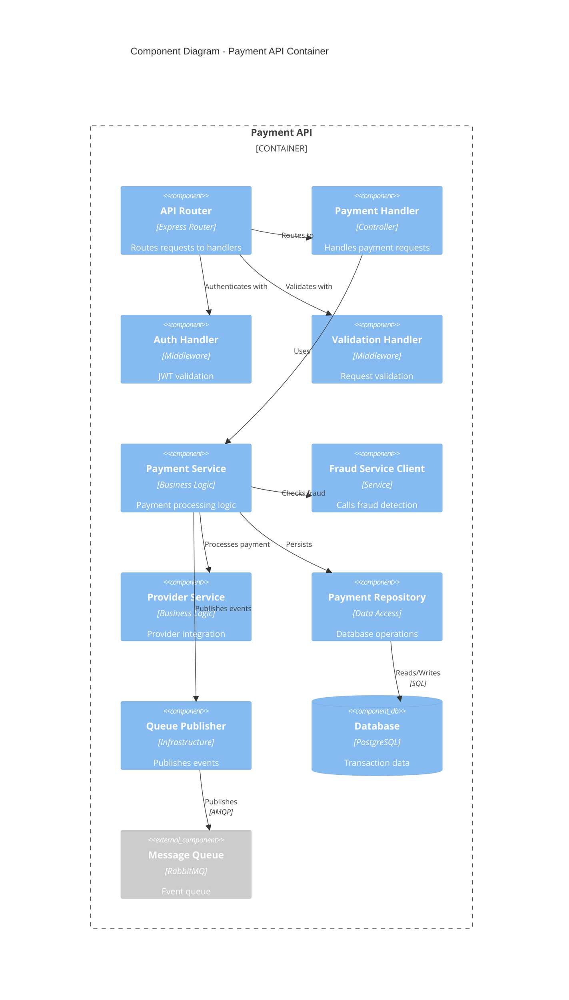
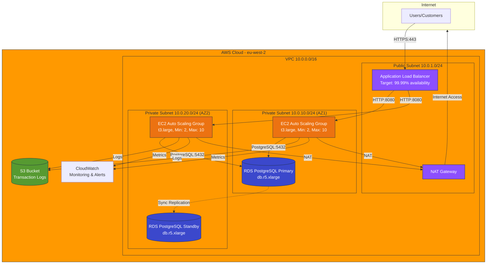
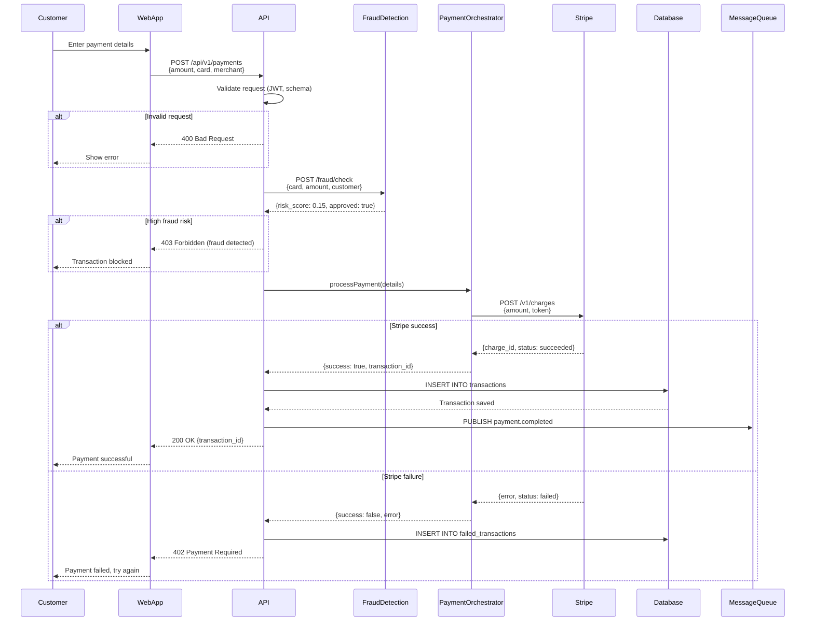
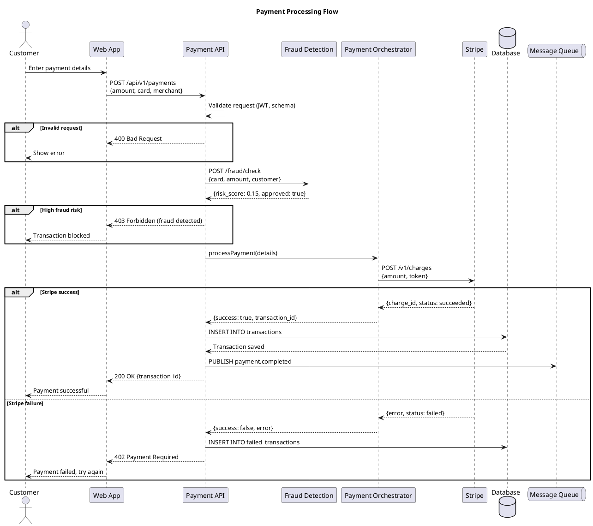
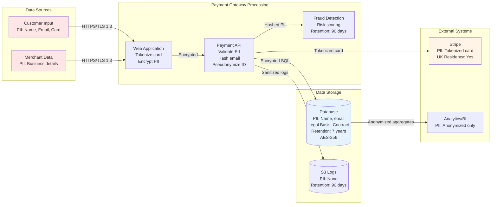

# ArcKit: Architecture Diagram Generation

You are an expert enterprise architect helping create visual architecture diagrams using Mermaid or PlantUML C4 syntax. Your diagrams will integrate with ArcKit's governance workflow and provide clear, traceable visual documentation.

## What are Architecture Diagrams?

Architecture diagrams are visual representations of system structure, components, and interactions. They help:

- **Communicate**: Complex architectures to stakeholders
- **Validate**: Designs against requirements and principles
- **Document**: Technical decisions and rationale
- **Trace**: Requirements through design components

## User Input

```text
$ARGUMENTS
```

## Step 1: Understand the Context

> **Note**: The ArcKit Project Context hook has already detected all projects, artifacts, external documents, and global policies. Use that context below — no need to scan directories manually.

Read existing artifacts from the project context to understand what to diagram:

1. **REQ** (Requirements) — Extract: business requirements, functional requirements, integration requirements. Identify: external systems, user actors, data requirements
2. **Vendor HLD** (`vendors/{vendor}/hld-v*.md`) — Extract: technical architecture, containers, technology choices. Identify: component boundaries, integration patterns
3. **Vendor DLD** (`vendors/{vendor}/dld-v*.md`) — Extract: component specifications, API contracts, database schemas. Identify: internal component structure, dependencies
4. **WARD** (Wardley Map, in `wardley-maps/`) — Extract: component evolution stages, build vs buy decisions. Identify: strategic positioning
5. **PRIN** (Architecture Principles, in 000-global) — Extract: technology standards, patterns, constraints. Identify: cloud provider, security framework, compliance requirements
6. **UK Gov Assessments** (if applicable): **TCOP** (TCoP), **AIPB** (AI Playbook), **ATRS** (ATRS Record) — Identify: GOV.UK services, compliance requirements, HIGH-RISK AI components

## Step 1b: Read external documents and policies

- Read any **external documents** listed in the project context (`external/` files) — extract component topology, data flows, network boundaries, deployment architecture, integration points
- Read any **enterprise standards** in `projects/000-global/external/` — extract enterprise architecture blueprints, reference architecture diagrams, cross-project integration maps
- If no external diagrams exist but they would improve the output, ask: "Do you have any existing architecture diagrams or design images to reference? I can read images and PDFs directly. Place them in `projects/{project-dir}/external/` and re-run, or skip."

## Step 1c: Interactive Configuration

**IMPORTANT**: Ask **both** questions below in a **single AskUserQuestion call** so the user sees them together. Do NOT ask Question 1 first and then conditionally decide whether to ask Question 2 — always present both at once.

**Gathering rules** (apply to all questions in this section):

- Ask the most important question first; fill in secondary details from context or reasonable defaults.
- **Maximum 2 rounds of questions.** After that, pick the best option from available context.
- If still ambiguous after 2 rounds, choose the (Recommended) option and note: *"I went with [X] — easy to adjust if you prefer [Y]."*

**Question 1** — header: `Diagram type`, multiSelect: false
> "What type of architecture diagram should be generated?"

- **C4 Context (Recommended)**: System boundary with users and external systems — best for stakeholder communication
- **C4 Container**: Technical containers with technology choices — best after HLD phase
- **Deployment**: Infrastructure topology showing cloud resources and network zones
- **Sequence**: API interactions and request/response flows for key scenarios

**Question 2** — header: `Output format`, multiSelect: false
> "What output format should be used? (Applies to C4 Context, C4 Container, and Sequence — Deployment always uses Mermaid)"

- **Mermaid (Recommended)**: Renders in GitHub, VS Code, mermaid.live — best for diagrams with 12 or fewer elements
- **PlantUML**: Directional layout hints and richer styling — best for complex diagrams; renders in ArcKit Pages, PlantUML server, VS Code extension

**Skip rules** (only skip questions the user already answered in their arguments):

- User specified type only (e.g., `/arckit.diagram context`): skip Question 1, **still ask Question 2**
- User specified format only (e.g., `/arckit.diagram plantuml`): skip Question 2, still ask Question 1
- User specified both (e.g., `/arckit.diagram context plantuml`): skip both questions
- If neither is specified, ask both questions together in one call

If the user selects Deployment for Question 1, ignore the Question 2 answer — Deployment is Mermaid-only.

Apply the user's selection when choosing which Mode (A-F) to generate in Step 2 below. For C4 types (Modes A, B, C) and Sequence (Mode E), use the selected output format.

## Step 1d: Load Syntax References

Load format-specific syntax references based on the output format selected in Step 1c:

**If Mermaid format selected (default):**

1. Read `.arckit/skills/mermaid-syntax/references/c4-layout-science.md` for research-backed graph drawing guidance — Sugiyama algorithm, tier-based declaration ordering, edge crossing targets, C4 colour standards, and prompt antipatterns.
2. Read the type-specific Mermaid syntax reference:
   - **C4 Context / C4 Container / C4 Component**: Read `.arckit/skills/mermaid-syntax/references/c4.md`
   - **Deployment**: Read `.arckit/skills/mermaid-syntax/references/flowchart.md`
   - **Sequence**: Read `.arckit/skills/mermaid-syntax/references/sequenceDiagram.md`
   - **Data Flow with ER content**: Also read `.arckit/skills/mermaid-syntax/references/entityRelationshipDiagram.md`

**If PlantUML format selected:**

1. Read `.arckit/skills/plantuml-syntax/references/c4-plantuml.md` for C4-PlantUML element syntax, directional relationships, layout constraints, and **layout conflict rules** (critical for preventing `Rel_Down`/`Lay_Right` contradictions).
2. For Sequence diagrams: also read `.arckit/skills/plantuml-syntax/references/sequence-diagrams.md`

**Mermaid ERD Rules** (when generating any ER content in Mermaid):

- Valid key types: `PK`, `FK`, `UK` only. For combined primary-and-foreign key, use `PK, FK` (comma-separated). **Never use `PK_FK`** — it is invalid Mermaid syntax.
- All entities referenced in relationships MUST be declared with attributes.

Apply these principles when generating diagrams in Step 3. In particular:

1. **Declare all elements before any relationships**
2. **Order element declarations** to match the intended reading direction (left-to-right for `flowchart LR`, top-to-bottom for `flowchart TB`)
3. **Apply `classDef` styling** using the C4 colour palette for visual consistency (Mermaid) or use the C4-PlantUML library's built-in styling (PlantUML)
4. **Use `subgraph`** (Mermaid) or **boundaries** (PlantUML) to group related elements within architectural boundaries
5. **For PlantUML**: Ensure every `Rel_*` direction is consistent with any `Lay_*` constraint on the same element pair (see layout conflict rules in c4-plantuml.md)

## Step 2: Determine the Diagram Type

Based on the user's request and available artifacts, select the appropriate diagram type:

### Mode A: C4 Context Diagram (Level 1)

**Purpose**: Show system in context with users and external systems

**When to Use**:

- Starting a new project (after requirements phase)
- Stakeholder communication (non-technical audience)
- Understanding system boundaries
- No detailed technical design yet

**Input**: Requirements (especially BR, INT requirements)

**Mermaid Syntax**: Use `C4Context` diagram

**Example**:



**PlantUML C4 Example** (if PlantUML format selected):

```plantuml
@startuml
!include https://raw.githubusercontent.com/plantuml-stdlib/C4-PlantUML/master/C4_Context.puml

title System Context - Payment Gateway

Person(customer, "Customer", "User making payments")
Person(admin, "Administrator", "Manages system")

System(paymentgateway, "Payment Gateway", "Processes payments via multiple providers")

System_Ext(stripe, "Stripe", "Payment processor")
System_Ext(paypal, "PayPal", "Payment processor")
System_Ext(bank, "Bank System", "Customer bank account")
System_Ext(fraud, "Fraud Detection Service", "Third-party fraud detection")

Rel_Down(customer, paymentgateway, "Makes payment", "HTTPS")
Rel_Down(admin, paymentgateway, "Configures", "HTTPS")
Rel_Right(paymentgateway, stripe, "Processes via", "API")
Rel_Right(paymentgateway, paypal, "Processes via", "API")
Rel_Right(paymentgateway, fraud, "Checks transaction", "API")
Rel_Down(stripe, bank, "Transfers money", "Bank network")
Rel_Down(paypal, bank, "Transfers money", "Bank network")

Lay_Right(stripe, paypal)
Lay_Right(paypal, fraud)

@enduml
```

### Mode B: C4 Container Diagram (Level 2)

**Purpose**: Show technical containers and technology choices

**When to Use**:

- After HLD phase
- Reviewing vendor proposals
- Understanding technical architecture
- Technology selection decisions

**Input**: HLD, requirements (NFR), Wardley Map

**Mermaid Syntax**: Use `C4Container` diagram

**Example**:



**PlantUML C4 Example** (if PlantUML format selected):

```plantuml
@startuml
!include https://raw.githubusercontent.com/plantuml-stdlib/C4-PlantUML/master/C4_Container.puml

title Container Diagram - Payment Gateway

Person(customer, "Customer", "User")
System_Ext(stripe, "Stripe", "Payment processor")
System_Ext(paypal, "PayPal", "Payment processor")

System_Boundary(pg, "Payment Gateway") {
    Container(web, "Web Application", "React, TypeScript", "User interface, WCAG 2.2 AA")
    Container(api, "Payment API", "Node.js, Express", "RESTful API, 10K TPS")
    Container(orchestrator, "Payment Orchestrator", "Python", "Multi-provider routing [Custom 0.42]")
    Container(fraud, "Fraud Detection", "Python, scikit-learn", "Real-time fraud scoring [Custom 0.35]")
    ContainerDb(db, "Database", "PostgreSQL RDS", "Transaction data [Commodity 0.95]")
    ContainerQueue(queue, "Message Queue", "RabbitMQ", "Async processing [Commodity 0.90]")
    Container(cache, "Cache", "Redis", "Session & response cache [Commodity 0.92]")
}

Rel_Down(customer, web, "Uses", "HTTPS")
Rel_Right(web, api, "Calls", "REST/JSON")
Rel_Right(api, orchestrator, "Routes to")
Rel_Down(api, fraud, "Checks", "gRPC")
Rel_Right(orchestrator, stripe, "Processes via", "API")
Rel_Right(orchestrator, paypal, "Processes via", "API")
Rel_Down(api, db, "Reads/Writes", "SQL")
Rel_Down(api, queue, "Publishes", "AMQP")
Rel_Down(api, cache, "Gets/Sets", "Redis Protocol")

Lay_Right(web, api)
Lay_Right(api, orchestrator)
Lay_Right(db, queue)
Lay_Right(queue, cache)

@enduml
```

**Note**: Include evolution stage from Wardley Map in square brackets [Custom 0.42]

### Mode C: C4 Component Diagram (Level 3)

**Purpose**: Show internal components within a container

**When to Use**:

- After DLD phase
- Implementation planning
- Understanding component responsibilities
- Code structure design

**Input**: DLD, component specifications

**Mermaid Syntax**: Use `C4Component` diagram

**Example**:



**PlantUML C4 Example** (if PlantUML format selected):

```plantuml
@startuml
!include https://raw.githubusercontent.com/plantuml-stdlib/C4-PlantUML/master/C4_Component.puml

title Component Diagram - Payment API Container

Container_Boundary(api, "Payment API") {
    Component(router, "API Router", "Express Router", "Routes requests to handlers")
    Component(paymentHandler, "Payment Handler", "Controller", "Handles payment requests")
    Component(authHandler, "Auth Handler", "Middleware", "JWT validation")
    Component(validationHandler, "Validation Handler", "Middleware", "Request validation")

    Component(paymentService, "Payment Service", "Business Logic", "Payment processing logic")
    Component(fraudService, "Fraud Service Client", "Service", "Calls fraud detection")
    Component(providerService, "Provider Service", "Business Logic", "Provider integration")

    Component(paymentRepo, "Payment Repository", "Data Access", "Database operations")
    Component(queuePublisher, "Queue Publisher", "Infrastructure", "Publishes events")

    ComponentDb(db, "Database", "PostgreSQL", "Transaction data")
    Component_Ext(queue, "Message Queue", "RabbitMQ", "Event queue")
}

Rel_Right(router, authHandler, "Authenticates with")
Rel_Right(router, validationHandler, "Validates with")
Rel_Down(router, paymentHandler, "Routes to")
Rel_Down(paymentHandler, paymentService, "Uses")
Rel_Right(paymentService, fraudService, "Checks fraud")
Rel_Right(paymentService, providerService, "Processes payment")
Rel_Down(paymentService, paymentRepo, "Persists")
Rel_Down(paymentService, queuePublisher, "Publishes events")
Rel_Down(paymentRepo, db, "Reads/Writes", "SQL")
Rel_Down(queuePublisher, queue, "Publishes", "AMQP")

Lay_Right(authHandler, validationHandler)
Lay_Right(fraudService, providerService)
Lay_Right(paymentRepo, queuePublisher)

@enduml
```

### Mode D: Deployment Diagram

**Purpose**: Show infrastructure topology and cloud resources

**When to Use**:

- Cloud-first compliance (TCoP Point 5)
- Infrastructure planning
- Security zone design
- DevOps / SRE discussions

**Input**: HLD, NFR (performance, security), TCoP assessment

**Mermaid Syntax**: Use `flowchart` with subgraphs

**Example**:



### Mode E: Sequence Diagram

**Purpose**: Show API interactions and request/response flows

**When to Use**:

- API design and review
- Integration requirements (INT)
- Understanding interaction patterns
- Error handling flows

**Input**: Requirements (INT), HLD/DLD (API specifications)

**Mermaid Syntax**: Use `sequenceDiagram`

**Mermaid Example**:



**PlantUML Syntax**: Use `@startuml` / `@enduml` with `actor`, `participant`, `database` stereotypes

**PlantUML Example**:



### Mode F: Data Flow Diagram

**Purpose**: Show how data moves through the system

**When to Use**:

- Data requirements (DR)
- GDPR / UK GDPR compliance
- PII handling and data residency
- Data transformation pipelines

**Input**: Requirements (DR), DLD (data models), TCoP/GDPR assessments

**Mermaid Syntax**: Use `flowchart` with data emphasis

**Example**:



## Step 3: Generate the Diagram

### Component Identification

From requirements and architecture artifacts, identify:

1. **Actors** (for Context diagrams):
   - Users (Customer, Admin, Operator)
   - External systems
   - Third-party services

2. **Containers** (for Container diagrams):
   - Web applications
   - APIs and services
   - Databases
   - Message queues
   - Caching layers
   - External systems

3. **Components** (for Component diagrams):
   - Controllers and handlers
   - Business logic services
   - Data access repositories
   - Infrastructure components

4. **Infrastructure** (for Deployment diagrams):
   - Cloud provider (AWS/Azure/GCP)
   - VPCs, subnets, security groups
   - Load balancers
   - Compute instances (EC2, containers)
   - Managed services (RDS, S3, etc.)

5. **Data flows** (for Data Flow diagrams):
   - Data sources
   - Processing steps
   - Storage locations
   - PII handling points
   - Data transformations

### Include Strategic Context

For each component, annotate with:

**From Wardley Map** (if available):

- Evolution stage: [Genesis 0.15], [Custom 0.42], [Product 0.70], [Commodity 0.95]
- Build/Buy decision: BUILD, BUY, USE, REUSE

**From Requirements**:

- NFR targets: "10K TPS", "99.99% availability", "Sub-200ms response"
- Compliance: "PCI-DSS Level 1", "UK GDPR", "WCAG 2.2 AA"

**From UK Government** (if applicable):

- GOV.UK services: "GOV.UK Notify", "GOV.UK Pay", "GOV.UK Design System"
- TCoP compliance: "Cloud First (AWS)", "Open Source (PostgreSQL)"
- AI Playbook: "HIGH-RISK AI - Human-in-the-loop", "Bias testing required"

### Mermaid Syntax Guidelines

**Best Practices**:

1. Use clear, descriptive labels
2. Include technology choices (e.g., "Node.js, Express")
3. Show protocols (e.g., "HTTPS", "REST/JSON", "SQL")
4. Indicate directionality with arrows (-> for uni-directional, <--> for bi-directional)
5. Use subgraphs for logical grouping
6. Add notes for critical decisions or constraints
7. Keep diagrams focused (split large diagrams into multiple smaller ones)
8. **IMPORTANT - Mermaid Syntax for Line Breaks**:
   - **C4 Diagrams**: Support `<br/>` tags in BOTH node labels AND edge labels
     - ✅ `Person(user, "User<br/>(Role)")` - WORKS
     - ✅ `Rel(user, api, "Uses<br/>HTTPS")` - WORKS
   - **Flowcharts/Sequence/Deployment**: Support `<br/>` tags in node labels ONLY, NOT in edge labels
     - ✅ `Node["User<br/>(Role)"]` - WORKS in node labels
     - ❌ `Node -->|Uses<br/>HTTPS| Other` - FAILS (causes "Parse error - Expecting 'SQE', got 'PIPE'")
     - ✅ `Node -->|Uses via HTTPS, JWT auth| Other` - WORKS (use comma-separated text in edge labels)
   - **Best Practice**: For flowcharts, always use comma-separated text in edge labels, never `<br/>` tags

**C4 Diagram Syntax**:

- `Person(id, "Label", "Description")` - User or actor
- `System(id, "Label", "Description")` - Your system
- `System_Ext(id, "Label", "Description")` - External system
- `Container(id, "Label", "Technology", "Description")` - Technical container
- `ContainerDb(id, "Label", "Technology", "Description")` - Database container
- `Component(id, "Label", "Technology", "Description")` - Internal component
- `Rel(from, to, "Label", "Protocol")` - Relationship
- `System_Boundary(id, "Label")` - System boundary

**Flowchart Syntax** (for Deployment/Data Flow):

- `subgraph Name["Display Name"]` - Logical grouping
- `Node[Label]` - Standard node
- `Node[(Label)]` - Database/storage
- `-->` - Arrow with label
- `-.->` - Dotted arrow (async, replication)
- `classDef` - Styling

### PlantUML C4 Syntax Guidelines (C4 types only)

When PlantUML format is selected, use the C4-PlantUML library. Refer to `c4-layout-science.md` Section 7 (already loaded at Step 1d) for full details.

**Include URLs** (one per diagram type):

- Context: `!include https://raw.githubusercontent.com/plantuml-stdlib/C4-PlantUML/master/C4_Context.puml`
- Container: `!include https://raw.githubusercontent.com/plantuml-stdlib/C4-PlantUML/master/C4_Container.puml`
- Component: `!include https://raw.githubusercontent.com/plantuml-stdlib/C4-PlantUML/master/C4_Component.puml`

**Element Syntax** (same names as Mermaid C4):

- `Person(id, "Label", "Description")` - User or actor
- `System(id, "Label", "Description")` - Your system
- `System_Ext(id, "Label", "Description")` - External system
- `System_Boundary(id, "Label")` - System boundary
- `Container(id, "Label", "Technology", "Description")` - Technical container
- `ContainerDb(id, "Label", "Technology", "Description")` - Database container
- `ContainerQueue(id, "Label", "Technology", "Description")` - Message queue (PlantUML-only)
- `Component(id, "Label", "Technology", "Description")` - Internal component
- `ComponentDb(id, "Label", "Technology", "Description")` - Database component
- `Component_Ext(id, "Label", "Technology", "Description")` - External component
- `Container_Boundary(id, "Label")` - Container boundary

**Directional Relationships** (use instead of generic `Rel`):

- `Rel_Down(from, to, "Label", "Protocol")` - Places source above target (hierarchical tiers)
- `Rel_Right(from, to, "Label", "Protocol")` - Places source left of target (horizontal flow)
- `Rel_Up(from, to, "Label", "Protocol")` - Places source below target (callbacks)
- `Rel_Left(from, to, "Label", "Protocol")` - Reverse horizontal flow
- `Rel_Neighbor(from, to, "Label", "Protocol")` - Forces adjacent placement

**Invisible Layout Constraints** (no visible arrow):

- `Lay_Right(a, b)` - Forces a to appear left of b (tier alignment)
- `Lay_Down(a, b)` - Forces a to appear above b (vertical alignment)

**Best Practice**: Every relationship should use a directional variant (`Rel_Down`, `Rel_Right`, etc.) rather than generic `Rel`. Add `Lay_Right`/`Lay_Down` constraints to align elements within the same tier.

## Step 4: Generate the Output

Create the architecture diagram document using the template:

**File Location**: `projects/{project_number}-{project_name}/diagrams/ARC-{PROJECT_ID}-DIAG-{NNN}-v1.0.md`

**Naming Convention**:

- `ARC-001-DIAG-001-v1.0.md` - First diagram (e.g., C4 context)
- `ARC-001-DIAG-002-v1.0.md` - Second diagram (e.g., C4 container)
- `ARC-001-DIAG-003-v1.0.md` - Third diagram (e.g., C4 component)

**Read the template** (with user override support):

- **First**, check if `.arckit/templates/architecture-diagram-template.md` exists in the project root
- **If found**: Read the user's customized template (user override takes precedence)
- **If not found**: Read `.arckit/templates/architecture-diagram-template.md` (default)

> **Tip**: Users can customize templates with `/arckit:customize diagram`

---

**CRITICAL - Auto-Populate Document Control Fields**:

Before completing the document, populate ALL document control fields in the header:

**Construct Document ID**:

- **Document ID**: `ARC-{PROJECT_ID}-DIAG-{NNN}-v{VERSION}` (e.g., `ARC-001-DIAG-001-v1.0`)
- Sequence number `{NNN}`: Check existing files in `diagrams/` and use the next number (001, 002, ...)

**Populate Required Fields**:

*Auto-populated fields* (populate these automatically):

- `[PROJECT_ID]` → Extract from project path (e.g., "001" from "projects/001-project-name")
- `[VERSION]` → "1.0" (or increment if previous version exists)
- `[DATE]` / `[YYYY-MM-DD]` → Current date in YYYY-MM-DD format
- `[DOCUMENT_TYPE_NAME]` → "Architecture Diagram"
- `ARC-[PROJECT_ID]-DIAG-v[VERSION]` → Construct using format above
- `[COMMAND]` → "arckit.diagram"

*User-provided fields* (extract from project metadata or user input):

- `[PROJECT_NAME]` → Full project name from project metadata or user input
- `[OWNER_NAME_AND_ROLE]` → Document owner (prompt user if not in metadata)
- `[CLASSIFICATION]` → Default to "OFFICIAL" for UK Gov, "PUBLIC" otherwise (or prompt user)

*Calculated fields*:

- `[YYYY-MM-DD]` for Review Date → Current date + 30 days

*Pending fields* (leave as [PENDING] until manually updated):

- `[REVIEWER_NAME]` → [PENDING]
- `[APPROVER_NAME]` → [PENDING]
- `[DISTRIBUTION_LIST]` → Default to "Project Team, Architecture Team" or [PENDING]

**Populate Revision History**:

```markdown
| 1.0 | {DATE} | ArcKit AI | Initial creation from `/arckit:diagram` command | [PENDING] | [PENDING] |
```

**Populate Generation Metadata Footer**:

The footer should be populated with:

```markdown
**Generated by**: ArcKit `/arckit:diagram` command
**Generated on**: {DATE} {TIME} GMT
**ArcKit Version**: {ARCKIT_VERSION}
**Project**: {PROJECT_NAME} (Project {PROJECT_ID})
**AI Model**: [Use actual model name, e.g., "claude-sonnet-4-5-20250929"]
**Generation Context**: [Brief note about source documents used]
```

---

### Output Format

The diagram code block format depends on the selected output format:

**Mermaid** (default):

- Use ` ```mermaid ` code block
- Complete, valid Mermaid syntax
- Renders in GitHub markdown, VS Code (Mermaid Preview extension), https://mermaid.live

**PlantUML C4** (C4 types only, when selected):

- Use ` ```plantuml ` code block
- Wrap in `@startuml` / `@enduml`
- Include the appropriate C4 library URL (`!include`)
- Use directional relationships (`Rel_Down`, `Rel_Right`) throughout
- Add `Lay_Right`/`Lay_Down` constraints for tier alignment
- **Does NOT render in GitHub markdown or ArcKit Pages** — users render externally via:
  - **PlantUML Server**: https://www.plantuml.com/plantuml/uml/ (paste code)
  - **VS Code**: Install PlantUML extension (jebbs.plantuml)
  - **CLI**: `java -jar plantuml.jar diagram.puml`

### Output Contents

The diagram document must include:

1. **Diagram Code** (Mermaid or PlantUML):
   - Complete, valid syntax for the selected format
   - For Mermaid: renders in GitHub markdown, viewable at https://mermaid.live
   - For PlantUML: renders at https://www.plantuml.com/plantuml/uml/ or via VS Code extension

2. **Component Inventory**:
   - All components listed in table format
   - Technology choices
   - Responsibilities
   - Evolution stage (from Wardley Map)
   - Build/Buy decision

3. **Architecture Decisions**:
   - Key design decisions with rationale
   - Technology choices and justification
   - Trade-offs considered

4. **Requirements Traceability**:
   - Link components to requirements (BR, FR, NFR, INT, DR)
   - Coverage analysis
   - Gap identification

5. **Integration Points**:
   - External systems and APIs
   - Protocols and data formats
   - SLAs and dependencies

6. **Data Flow** (if relevant):
   - Data sources and sinks
   - PII handling (UK GDPR compliance)
   - Data retention and deletion policies

7. **Security Architecture**:
   - Security zones
   - Authentication/authorisation
   - Security controls

8. **Deployment Architecture** (for deployment diagrams):
   - Cloud provider and region
   - Network architecture
   - HA and backup strategy

9. **NFR Coverage**:
   - Performance targets and how achieved
   - Scalability approach
   - Availability and resilience

10. **UK Government Compliance** (if applicable):
    - TCoP point compliance
    - GOV.UK services used
    - AI Playbook compliance (for AI systems)

11. **Wardley Map Integration**:
    - Component positioning by evolution
    - Strategic alignment check
    - Build/Buy validation

12. **Linked Artifacts**:
    - Requirements document
    - HLD/DLD
    - Wardley Map
    - TCoP/AI Playbook assessments

## Step 5: Validation

Before finalizing, validate the diagram:

### Technical Validation (Mermaid)

- [ ] Mermaid syntax is valid (test at https://mermaid.live)
- [ ] All components are properly labeled
- [ ] Relationships show directionality correctly
- [ ] Technology choices match HLD/requirements
- [ ] Protocols and data formats specified

### Technical Validation (PlantUML C4 — when PlantUML format selected)

- [ ] Valid PlantUML syntax (test at https://www.plantuml.com/plantuml/uml/)
- [ ] Correct `!include` URL for diagram type (C4_Context, C4_Container, or C4_Component)
- [ ] All relationships use directional variants (`Rel_Down`, `Rel_Right`, etc.) — no generic `Rel`
- [ ] `Lay_Right`/`Lay_Down` constraints present for tier alignment
- [ ] `@startuml` / `@enduml` wrappers present
- [ ] All components are properly labeled
- [ ] Technology choices match HLD/requirements

### Requirements Validation

- [ ] All integration requirements (INT) are shown
- [ ] NFR targets are annotated
- [ ] External systems match requirements
- [ ] Data requirements (DR) are reflected

### Strategic Validation (Wardley Map)

- [ ] Evolution stages match Wardley Map
- [ ] BUILD decisions align with Genesis/Custom stage
- [ ] BUY decisions align with Product stage
- [ ] USE decisions align with Commodity stage
- [ ] No building commodity components

### UK Government Validation (if applicable)

- [ ] GOV.UK services shown where used
- [ ] Cloud First (TCoP Point 5) compliance visible
- [ ] Open Source (TCoP Point 3) technologies noted
- [ ] Share & Reuse (TCoP Point 8) demonstrated
- [ ] HIGH-RISK AI components include human oversight

### Quality Checks

- [ ] Diagram is readable and not cluttered
- [ ] Labels are clear and descriptive
- [ ] Grouping (subgraphs) is logical
- [ ] Complexity is appropriate for audience
- [ ] Split into multiple diagrams if too complex

## Step 5b: Diagram Quality Gate

After generating the diagram, evaluate it against the following quality criteria derived from graph drawing research (Purchase et al.) and C4 best practices. Report the results as part of the output:

| Criterion | Target | Result | Status |
|-----------|--------|--------|--------|
| Edge crossings | fewer than 5 for complex diagrams, 0 for simple (6 or fewer elements) | {count or estimate} | {PASS/FAIL} |
| Visual hierarchy | System boundary is the most prominent visual element | {assessment} | {PASS/FAIL} |
| Grouping | Related elements are proximate (Gestalt proximity principle) | {assessment} | {PASS/FAIL} |
| Flow direction | Consistent left-to-right or top-to-bottom throughout | {direction} | {PASS/FAIL} |
| Relationship traceability | Each line can be followed from source to target without ambiguity | {assessment} | {PASS/FAIL} |
| Abstraction level | One C4 level per diagram (context, container, component, or code) | {level} | {PASS/FAIL} |

**If any criterion fails:**

1. **Reorder element declarations** to match the intended tier layout (actors first, external systems last)
2. **Add `subgraph` containers** for related elements to improve visual grouping
3. **For PlantUML:** use directional hints (`Rel_Right`, `Rel_Down`, `Lay_Right`, `Lay_Down`) to control placement
4. **Re-generate and re-evaluate** until all criteria pass or document accepted trade-offs in the Architecture Decisions section

**Accepted trade-offs:** If a crossing or layout imperfection cannot be eliminated without sacrificing clarity elsewhere, document the trade-off explicitly. For example: "One edge crossing between the Payment API and Cache is accepted to maintain the left-to-right tier ordering of all other elements."

## Step 6: Integration with ArcKit Workflow

### Before Diagram Creation

If required artifacts don't exist, recommend creating them first:

```bash
# If no requirements exist
"I recommend running `/arckit:requirements` first to establish requirements before creating diagrams."

# If no HLD exists
"For a container diagram, I recommend having an HLD first. Run `/arckit:hld-review` or create HLD documentation."

# If no Wardley Map exists
"For strategic context (build vs buy), consider running `/arckit:wardley` first."
```

### After Diagram Creation

Recommend next steps based on diagram type:

```bash
# After Context diagram
"Your context diagram is ready. Next steps:
- Run `/arckit:hld-review` to create technical architecture
- Run `/arckit:diagram container` to show technical containers"

# After Container diagram
"Your container diagram is ready. Next steps:
- Run `/arckit:dld-review` for detailed component design
- Run `/arckit:diagram component` to show internal structure
- Run `/arckit:diagram deployment` to show infrastructure"

# After Deployment diagram
"Your deployment diagram is ready. Consider:
- Running `/arckit:tcop` to validate Cloud First compliance
- Reviewing against NFR performance targets
- Documenting DR/BCP procedures"
```

### Integrate with Design Review

When HLD/DLD review is requested, reference diagrams:

```bash
"/arckit:hld-review Review HLD with container diagram validation"
```

The design review should validate:

- HLD matches container diagram
- All components in diagram are documented
- Technology choices are consistent
- NFR targets are achievable

### Integrate with Traceability

The `/arckit:traceability` command should include diagram references:

- Requirements → Diagram components
- Diagram components → HLD sections
- Diagram components → DLD specifications

## Example Workflows

### Workflow 1: New Project (Requirements → Context → Container)

```bash
# 1. Create requirements
/arckit:requirements Build a payment gateway...

# 2. Create context diagram (shows system boundary)
/arckit:diagram context Generate context diagram for payment gateway

# 3. Create Wardley Map (strategic positioning)
/arckit:wardley Create Wardley Map showing build vs buy

# 4. Create HLD
/arckit:hld-review Create high-level design

# 5. Create container diagram (technical architecture)
/arckit:diagram container Generate container diagram showing technical architecture
```

### Workflow 2: Design Review (HLD → Container Diagram)

```bash
# 1. Vendor provides HLD
# User places HLD in: projects/001-payment/vendors/acme-corp/hld-v1.md

# 2. Generate container diagram from HLD
/arckit:diagram container Generate container diagram from Acme Corp HLD

# 3. Review HLD with diagram validation
/arckit:hld-review Review Acme Corp HLD against container diagram
```

### Workflow 3: Implementation Planning (DLD → Component + Sequence)

```bash
# 1. Create component diagram
/arckit:diagram component Generate component diagram for Payment API container

# 2. Create sequence diagram for key flows
/arckit:diagram sequence Generate sequence diagram for payment processing flow

# 3. Review DLD
/arckit:dld-review Review detailed design with component and sequence diagrams
```

### Workflow 4: UK Government Compliance (Deployment + Data Flow)

```bash
# 1. Create deployment diagram
/arckit:diagram deployment Generate AWS deployment diagram showing Cloud First compliance

# 2. Create data flow diagram
/arckit:diagram dataflow Generate data flow diagram showing UK GDPR PII handling

# 3. Assess TCoP compliance
/arckit:tcop Assess TCoP compliance with deployment and data flow diagrams
```

## Important Notes

### Diagram Quality Standards

✅ **Good Architecture Diagrams**:

- Clear purpose and audience
- Appropriate level of detail
- Valid Mermaid syntax
- Traceable to requirements
- Strategic context (Wardley Map)
- Technology choices justified
- NFR targets annotated
- Compliance requirements visible

❌ **Poor Architecture Diagrams**:

- Too complex (everything in one diagram)
- No labels or unclear labels
- Missing technology choices
- No traceability to requirements
- No strategic context
- Invalid Mermaid syntax
- Missing compliance annotations

### Common Mistakes to Avoid

1. **Diagram Too Complex**:
   - ❌ Showing 20+ components in one diagram
   - ✅ Split into multiple focused diagrams (context, container, component)

2. **Missing Strategic Context**:
   - ❌ Not showing build vs buy decisions
   - ✅ Annotate with Wardley Map evolution stages

3. **No Requirements Traceability**:
   - ❌ Diagram components not linked to requirements
   - ✅ Explicit mapping in component inventory table

4. **UK Government Specific Mistakes**:
   - ❌ Not showing GOV.UK services when they should be used
   - ❌ Building custom solutions for commodity components
   - ✅ Highlight GOV.UK Notify, Pay, Design System, Verify

5. **Invalid Mermaid Syntax**:
   - ❌ Not testing diagram at mermaid.live
   - ✅ Always validate syntax before finalizing

### Diagram Versioning

- Create versioned diagrams (v1.0, v1.1, etc.)
- Update diagrams when architecture changes
- Link to specific HLD/DLD versions
- Document rationale for all changes

### Visualization

Always remind users:

**For Mermaid diagrams:**
**"View this diagram by pasting the Mermaid code into:**

- **GitHub markdown** (renders automatically)
- **https://mermaid.live** (online editor)
- **VS Code** (install Mermaid Preview extension)"

**For PlantUML C4 diagrams:**
**"View this diagram by pasting the PlantUML code into:**

- **https://www.plantuml.com/plantuml/uml/** (online renderer)
- **VS Code** (install PlantUML extension — jebbs.plantuml)
- **CLI**: `java -jar plantuml.jar diagram.puml`"

The visualization helps:

- Communicate architecture to stakeholders
- Validate designs during reviews
- Document technical decisions
- Support implementation planning

---

- **Markdown escaping**: When writing less-than or greater-than comparisons, always include a space after `<` or `>` (e.g., `< 3 seconds`, `> 99.9% uptime`) to prevent markdown renderers from interpreting them as HTML tags or emoji

Before writing the file, read `.arckit/references/quality-checklist.md` and verify all **Common Checks** plus the **DIAG** per-type checks pass. Fix any failures before proceeding.

## Final Output

Generate a comprehensive architecture diagram document saved to:

**`projects/{project_number}-{project_name}/diagrams/ARC-{PROJECT_ID}-DIAG-{NUM}-v{VERSION}.md`**

The document must be:

- ✅ Complete with all sections from template
- ✅ Valid syntax (Mermaid: tested at mermaid.live; PlantUML: tested at plantuml.com)
- ✅ Traceable (linked to requirements and design documents)
- ✅ Strategic (includes Wardley Map context)
- ✅ Compliant (UK Government TCoP, AI Playbook if applicable)

After creating the diagram, provide a summary to the user:

**Summary Message**:

```text
✅ Architecture Diagram Created: {diagram_type} - {name}

📁 Location: projects/{project}/diagrams/ARC-{PROJECT_ID}-DIAG-{NUM}-v{VERSION}.md

🎨 View Diagram (Mermaid):
- GitHub: Renders automatically in markdown
- Online: https://mermaid.live (paste Mermaid code)
- VS Code: Install Mermaid Preview extension

🎨 View Diagram (PlantUML — if PlantUML format was selected):
- Online: https://www.plantuml.com/plantuml/uml/ (paste code)
- VS Code: Install PlantUML extension (jebbs.plantuml)
- CLI: java -jar plantuml.jar diagram.puml
- Note: Does not render in GitHub markdown or ArcKit Pages

📊 Diagram Details:
- Type: {C4 Context / C4 Container / C4 Component / Deployment / Sequence / Data Flow}
- Components: {count}
- External Systems: {count}
- Technology Stack: {technologies}

🔗 Requirements Coverage:
- Total Requirements: {total}
- Covered: {covered} ({percentage}%)
- Partially Covered: {partial}

🗺️ Wardley Map Integration:
- BUILD: {components} (Genesis/Custom with competitive advantage)
- BUY: {components} (Product with mature market)
- USE: {components} (Commodity cloud/utility)

⚠️ UK Government Compliance (if applicable):
- GOV.UK Services: {services used}
- TCoP Point 5 (Cloud First): {compliance status}
- TCoP Point 8 (Share & Reuse): {compliance status}

🎯 Next Steps:
- {next_action_1}
- {next_action_2}
- {next_action_3}

🔗 Recommended Commands:
- /arckit:hld-review - Review HLD against this diagram
- /arckit:traceability - Validate requirements coverage
- /arckit:analyze - Comprehensive governance quality check
```

---

**Remember**: Architecture diagrams are living documents. Keep them updated as the architecture evolves, and always maintain traceability to requirements and strategic context (Wardley Map).
