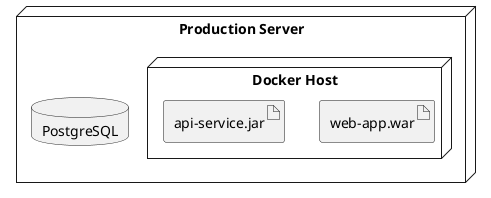
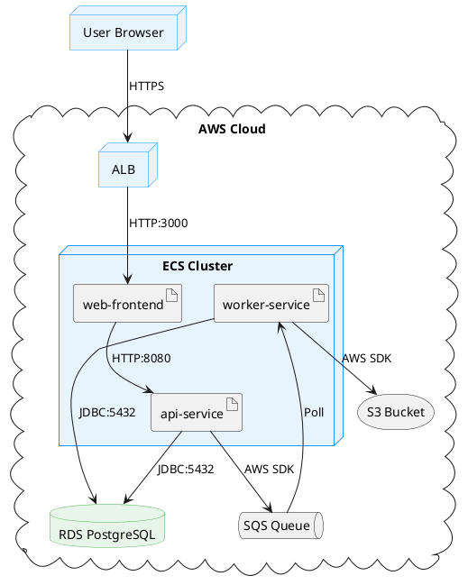

# PlantUML Deployment Diagrams

Deployment diagrams model the physical architecture of a system — nodes, devices, artifacts, and their relationships.

## Core Elements

| Element | Syntax | Description |
|---------|--------|-------------|
| Node | `node "Name" { }` | Generic processing node |
| Device | `device "Name" { }` | Physical device (server, phone) |
| Artifact | `artifact "Name"` | Deployable unit (JAR, WAR, binary) |
| Database | `database "Name"` | Database instance |
| Cloud | `cloud "Name" { }` | Cloud environment |
| Folder | `folder "Name" { }` | Logical grouping |
| Frame | `frame "Name" { }` | Named frame boundary |
| Package | `package "Name" { }` | Package grouping |
| Queue | `queue "Name"` | Message queue |
| Stack | `stack "Name"` | Stack of elements |
| Storage | `storage "Name"` | Storage device |
| File | `file "Name"` | File artifact |

## Nesting

Nodes and containers can be nested to show deployment topology:



## Relationships

| Syntax | Description |
|--------|-------------|
| `A -- B` | Solid line (association) |
| `A --> B` | Arrow |
| `A ..> B` | Dashed arrow (dependency) |
| `A -- B : label` | Association with label |
| `A --> B : "HTTPS"` | Arrow with protocol label |

## Aliases

Assign aliases for cleaner relationship definitions:

```plantuml
node "Web Server" as web
node "App Server" as app
database "Database" as db

web --> app : "REST API"
app --> db : "JDBC"
```

## Styling

| Skinparam | Example |
|-----------|---------|
| `skinparam node` | `skinparam node { BackgroundColor LightBlue }` |
| `skinparam database` | `skinparam database { BackgroundColor LightGreen }` |
| `skinparam artifact` | `skinparam artifact { BackgroundColor LightYellow }` |
| Individual color | `node "Name" #LightBlue` |

## Complete Worked Example



This example shows a typical AWS deployment with load balancer, ECS containers, RDS database, SQS queue, and S3 storage.
